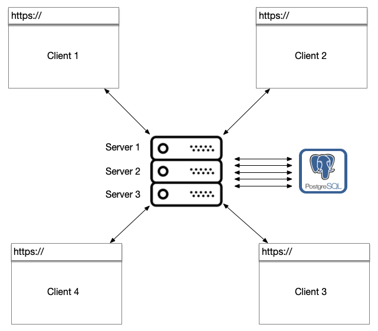
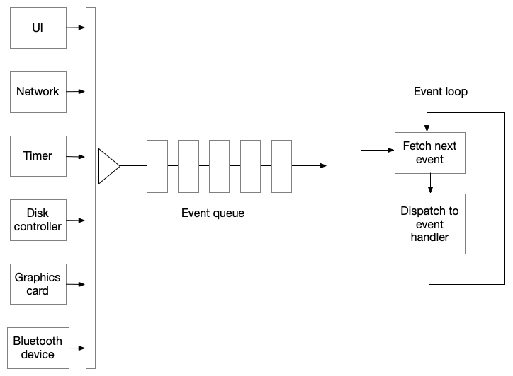
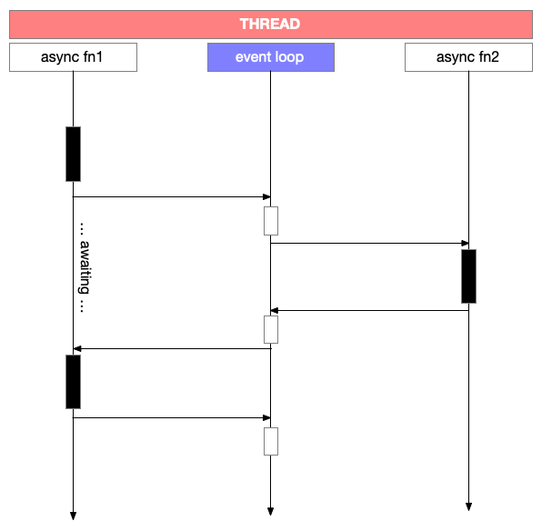

Concurrency
===========

(... vs "parallelism")

The internet's architecture means that machines can (in general) talk to
each other if they know each others' IP address, which they can often
get if they know the relevant domain names. This means that a "server"
computer running an application as a service can be hit with a request
from any number of "client" computers at any time.

   Each double-ended arrow depicts a stream of messages that can
   happen at any time concurrently with each other and the server
   and database need to do their job and service these requests 
   while maintaining expectations of the service.

This poses some important questions to ask of our application and
scenarios to test rigorously for production use.

1. What happens when our service handlers are hit "at the same time"
   by two different requests?

2. If our service handler modifies some piece of data in our database,
   then what happens when another request comes in when the earlier
   request is in the process of being handled and the database is
   still working on the previous statement?

3. What happens if our service request handler needs to make a request to
   another service to fulfil what was asked of it and that service is doing
   some destructive operation while another request comes in?

You can see how the "simplicity" of what we've been doing in our backend code
can cross over quickly into "damn, this is broken" territory in such a
common scenario. Welcome to back-end engineering, which focuses on a
principled way to build and deploy systems that can handle such loads!

A number of system approaches have evolved to deal with these concurrency
issues over time while, for the most part, retaining programming simplicity. In
this chapter, we look at two -- coroutining on a single thread, and database
transactions.

Terminology
-----------

**Concurrency** versus **parallelism**
    For our purposes, "concurrency" refers to activities that can happen on
    independent timelines either logically or literally. "Parallelism" refers
    to activities that necessarily happen on independent timelines. While
    "parallelism" usually refers to multiple processors working independently
    (even if they happen to be on the same chip), "concurrency" is used to talk
    about organizing computation as coordinated interactions between temporally
    independent agents -- virtual or real.

**Process**
    Refers to an independent unit of computation provided as a resource by the
    operating system. So it is considered short for "operating system process".
    Whenever you run a command on the shell, for example, you start such a
    "process", it runs until completion and then exits. Each such process has
    its own memory space assigned by the OS, which also manages fair allocation
    of compute time for all running processes on a finite number of available
    CPU "cores". If processes need to share information, they need to send it
    to each other via explicitly addressed messages using various
    "inter-process communication" (IPC) mechanisms such as "pipes", "sockets"
    and "message buses".

**Thread**
    Similar to a "process", this is provided as a resource by the operating
    system again. The main difference is that threads are resources that live
    within processes and can share memory. Since threads are started by the
    main program of a process, the OS assumes that the program knows how to
    manage the sharing of memory and resources between threads through various
    coordination mechanisms such as "mutexes", "semaphores", "signals" and
    "message queues".

**Event**
    A broad term that refers to a representation of something that happened at
    a particular time in relation to the system under consideration. For
    example, a packet received on the network, a mouse click made by a user, a
    timer that expired, are all such events.
    
**Event loop**
    A control loop that dispatches events coming in via a queue to assigned
    "handlers" which are functions that will perform some (hopefully brief) 
    computation and return quickly to the event loop. "Events" are populated 
    into a FIFO queue as they arrive and the event loop handles them one
    by one. 

**Handler**
    A function (usually a "closure") that is assigned to be called when a
    particular type of event is encountered. A given event may be assigned
    multiple handlers, all of which will be called in an undetermined order --
    usually in the order of installation of the handlers, but it is better to
    not assume that. An example mouse click event handler being attached to
    a button in a Javascript driven UI --

    .. code:: js

        document.getElementById("mybutton").addEventListener("click",
            function (event) {
                /// do stuff with `event`
            }
        );

    An API request handler in python being attached to an API end point using FastAPI --

    .. code:: python
        
        app = FastAPI()

        @app.get("/todolist/{item_id}")
        def get_todolist_item(item_id : int):
            # Find the item and construct an appropriate
            # JSON compatible representation of it.
            return item

Coroutining on a single thread
------------------------------

We know that our computers can run multiple processes in parallel -- as in two
instructions from two programs can be in the process of execution by the 
processor **at the same time** because our processors have multiple "cores",
with each "core" usually capable of service two "threads".

In the early days of the internet, every request from a client would be handled
by spawning off an operating system process and these issues of concurrency
were demonic to deal with without proper engineering and testing. These days
though, there is general recognition that much of the hard work is delegated to
other systems and the "server" process spends most of its time idling, waiting
for a request, rather than servicing a request.

To captialize on this observation, systems such as NodeJS and python now have
frameworks which essentially handle requests in a single operating system thread.
When we write our handlers as ordinary functions, this means that when one of
our handler functions is working, any request that comes in is placed into a
queue and will wait for the running handler to finish its job before the 
request gets handled. In this way, requests get "serialized".

   As different types of events come in from various sub-systems, they're
   added to a queue for processing. When the event loop gains control, it
   picks an event from the FIFO queue, calls the designed "handler" function,
   and then moves on to the next event once it regains control.

That alone is not sufficient and describes only "single threaded operation" and
no "coroutining". If we now consider the scenario that the handler function
might actually be twiddling its metaphorical thumbs waiting for a reply from
another service from across the world, it would seem unfair to the request
waiting in the queue that the thread is idle and yet it won't process the
request in the queue. Typically, such "thumb twiddling" happens during I/O
requests, either to subsystems on the same computer such as the file system or
GPU, or another process on the same system, or another process on another
computer.

To address this, Javascript and Python's "async/await" mechanism puts the
"event loop" (the "thumb twiddler") in control and turns the handlers into
functions that can "return" multiple times. So a handler that needs to wait for
another request to complete would do the following --

1. Create and send the request to the remote party.
2. Ask the event loop to resume the handler once the remote party responds.
3. Transfer control back to the event loop.

Now, the event loop is free to handle the next request in the queue
even though the earlier handler has not finished. To be clear, this
still does not clear our plate of potential problems since the request
the handler sent out could be destructive in some way and if another
request for the same thing comes in (called a "race condition"), we're
still left with the question of what should actually happen.

The concept of "generators" underlies the "async/await" mechanism by providing
the ability to "return" from a function  multiple times while preserving its
execution state, using a keyword such as ``yield``.

In python, coroutines are created using the keywords ``async`` (short for
asynchronous) and paused for results from another asynchronous operation using
the keyword ``await``.

   The sequence diagram illustrates how two routines (functions) cooperate via
   the event loop to yield time to other operations that need attention while
   within the same thread of control. You can see how at any time only one of
   the three are active. Such "cooperating routines" are why they're called
   "coroutines", as opposed to a "routine" which takes up all the resources of
   a thread for itself.

Database transactions
---------------------

If we now think of the database as a "service" and our application as its
"client", we can see how the database also needs to contend with potentially
conflicting requests. While one request asks the DB to modify some set of rows
in one way, another might come in and ask to modify an overlapping set of rows
in another way. What is a DB to do in such a scenario?

DB creators do what is best in such a circumstance -- which is to provide
the programmer with mechanisms using which they can dictate what is to happen.
One such mechanism is the "transaction".

A "transaction" refers to a carved out *sequence* of operations, which when
executed as unit, the database will guarantee some properties of the outcome -- 

1. The DB guarantees that either the transaction completes in its entirety,
   or fails entirely and will not leave the database in an intermediate 
   "half done" state. Think about this a bit and you'll see that it can take
   substantial machinery to ensure this property ... called "Atomicity".

2. The DB guarantees that the transaction will complete and leave the database
   in a "consistent" state -- where all the database constraints (such as inter-table
   relationships, index tables, etc.) are all consistent with the contents
   of the database. This property is referred to as "consistency".

3. Furthermore, the DB also guarantees that two concurrent transactions where
   one is writing to the DB and another is reading from it, won't see
   each others' intermediate states. Transactions are therefore said to be
   "isolated".

4. Once the DB declares a transaction to be complete, it guarantees that any
   data stored as a consequence will be retained in storage even if in that instant
   the database were to crash or the computer's power be cut off (or imagine
   any other such violent interruptions). This is called "durability".

Databases which provide transactions with all four of these properties (which
PostgreSQL_ and MySQL_ do as well as SQLite3_) are said to provide "ACID
transactions" where "ACID" is the common acronym for "Atomic, Consistent,
Isolated and Durable" transactions.

.. _PostgreSQL: https://www.postgresql.org/
.. _MySQL: https://www.mysql.com/
.. _sqlite3 documentation:
.. _sqlite3:
.. _sqlite: https://www.sqlite.org/index.html 

Unless you have a good reason not to, it is always good to execute your SQL
queries within a "transaction". With sqlite3, this is marked by the "begin"
and "commit"/"rollback" statements. So your python code will look like -

.. code:: python

    def do_transaction(db, args):
        with closing(db.cursor()) as cur:
            cur.execute("begin")
            try:
                # Run your SQL commands that must be run as a unit.
                # cur.execute("...")
                # cur.execute("...")

                # Finally "commit" your transaction.
                cur.execute("commit")
            catch db.Error:
                # In case some failure occurred during the transaction,
                # we should "rollback" any changes that we happened to do
                # so that the database stays consistent.
                cur.execute("rollback")

With these, we're still running our database queries synchronously and therefore
need to address the question of "what happens when it takes a long time to
respond to a query?". The aiosqlite_ package in python turns the DB calls into
async calls and therefore returns frequently enough to the event loop to not block
other requests to our server.

.. _aiosqlite: https://github.com/omnilib/aiosqlite

Communicating Sequential Processes (CSP)
----------------------------------------

CSP offers a way to organize concurrent computation that's gained significant
adoption of late, in addition to the "async/await" based approaches. In this
model, logically isolated processes cooperate to accomplish a task by sending
messages to each other via channels. Such a process typically waits for a
message on a channel (a message is an arbitrary piece of data in this case) and
uses it to advance its computation until it needs to either send or receive
another message.

Erlang_ and Elixir_ (based on Erlang) are languages that provide first
class runtimes that use this model to organize resilient concurrent computation
at scale.

.. _Erlang: https://www.erlang.org/
.. _Elixir: https://elixir-lang.org/

Golang_ also offers the CSP model via "go routines". Clojure_'s core.async_ library
also offers the CSP model.

.. _Golang: https://go.dev/
.. _Clojure: https://clojure.org/index
.. _core.async: https://clojure.org/reference/async

Promises and Futures
--------------------

The "async/await" mechanisms in Javascript and Python provide the notion of
"Promise" (in Javascript) and "Future") in python, where both those terms refer
to the same concept.

When an async task that is expected to complete after some time by returning a
value is started, it immediately returns with a placeholder object that's
called a "Promise" or a "Future" that represents the value that will be
available later, if the task is successful. Such an object provides a point to
which further computations that are to happen after the value becomes available
can be attached. With Javascript, ``Promise`` objects have a ``.then`` method
to which you can pass a function that will be called with "fulfilled value of
the promise" once it becomes available. The ``.then`` itself returns another
``Promise`` object which represents the future return value of the last
computation setup, and to which we can attach a further computation, and so on.
In the case of python's ``Future`` object, the corresponding method is
``add_done_callback``.

The ``async`` and ``await`` keywords are "syntactic sugar" on top of such
Promises/Futures.

