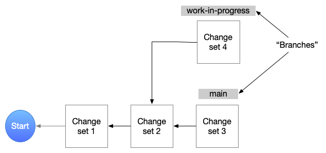

A student's guide to git
========================

Making worthy software involves collaborating with others as a team. With such
collaboration comes the complexity of managing who is working on what and when
and how are they doing it. Changes happen to the system all the time. Maybe two
of them tried to change the same parts .. and what happens then?

The role of a "source code management system" or "source control system" is to
help coordinate these changes as a project progresses, and beyond release and
during maintenance too ... as software is never truly "done".

There is another collaborator who is often ignore and that is oneself. Even
if a piece of software is being worked on by a solo developer, that developer
also undergoes change as understanding of the problem being worked on changes
over time and as new learning is acquired. So a programmer has to collaborate
with their future selves.

Today, "git" is the most widely used source control system and `github.com`_
is the most widely used online "collaboration as a service". In this chapter,
you'll be introduced to some of the mechanisms of git so you understand
what's going on to some extent and are also able to use it.

.. _github.com: https://github.com

.. admonition:: **Getting help**

    The ``git`` command line tool comes with built-in help on every command.
    Just typing ``git help`` will bring up a list of supported "sub commands".
    For any specific sub-command, you can type ``git help <subcommand>`` to get
    more detailed help. You can also do ``git <subcommand> --help`` to get the
    same help.

Getting started
---------------

1. Sign up for an account on `github.com`_. You'll have to choose a short name
   to refer to your account which is usually called your "github handle". Your
   "GitHub profile" (often used as a resumé these days) can be found at
   https://github.com/{yourhandle}. For example, mine is at
   https://github.com/srikumarks. 

2. Have one of your team members create a "repository" which will contain your
   project's materials -- source code, documentation, tests, examples, etc.
   Let's say the repository is called ``project350``.

3. If you've made your project public, then anyone will be able to "clone" your
   repository on their computers. "Cloning" refers to fetching the entire project
   along with its whole history into a local copy in order to peruse it or
   contribute to it. The command for clone is --

    .. code:: bash

        git clone <repo-url>

   I recommend you use the "ssh clone" URL so that you don't have to keep
   typing in your account password every time you want to contribute changes.

4. On `github.com`_, go to your ``project350`` repository settings and invite
   your team-mates as "collaborators". You can given them "developer" rights,
   which means your team-mates will be able to contribute to the repository.

5. When you clone the repository ("repo" for short), you also get a copy of the
   latest version of the files in the repo. This is usually called "a checkout".
   It's a bit anachronistic term today, but it's stuck with us.

6. ``git`` would've checked out what's called the ``main`` "branch" of the repo.

First steps
-----------

Once you've cloned ``project350``, you'll have a local folder with that same
name. Using the shell ``cd`` command, change the present working directory to
that folder. That will be  --

.. code:: bash

    cd project350

Create a new file named ``README.md`` (a convention on `github.com`_) for
repositories. This is a "Markdown" file that is expected to contain a
description of your project and anything you think someone interested in your
project might want to know about the project.

First off, you'll be making changes to the repo and your team-mates will need
to know who made what change. So you'll need to tell git who you are. You do
that using --

.. code:: bash

    git config user.name "C. V. Raman"
    git config user.email cvraman@krea.edu.in

Once you do that, git will remember this for your repository and note down your
name and email whenever you make a change to the repository.

Open ``README.md`` in a text editor such as VSCode and type in some description
and save it. Now do --

.. code:: bash

    git add README.md

This marks the changes in the file as "to be put into the repository" (a place
called the git "index") but it's not yet in the repository. Now do --

.. code:: bash

    git commit -m "Initial commit of README"

This will collect everything "added" so far and pack up those changes into a
bundle called a "commit". This commit will be linked to the currently checked
out "latest version" and then placed into your local clone of the repository.

At this stage, only you can see the changes you've made. It is not yet visible to
your team-mates. So you now need to "push" these changes to the repository copy
on `github.com`_ using --

.. code:: bash

    git push

Follow any instructions that the command might ask you to do when you push for
the first time.

.. admonition:: **All history is intact**

    When you edit any number of files and add them using ``git add`` and ``git
    commit`` the set of changes to your repository, nothing gets overwritten or
    lost. THe whole purpose of git is to never lose history (though there are
    commands to modify history which you should **NEVER** use). What git stores
    is simply the set of *changes* you made and you can think of a ``git checkout``
    instruction as "start at the the beginning where my repository was empty and
    apply all the changes I made one by one till you come to the latest version".
    Git works more efficiently than that, but in effect it is doing just that.
    You can see the sequence of changes using ``git log``.

    This figure shows the beginnings of a repository with two branches in progress.

In the figure above, note that the two branches share a couple of change sets,
although the view from each branch is as though it has a single linear history
traceable all the way to the "start". 

The arrows from each "change set" or "commit" point to the "parent commit",
which then points to its "parent", all the way back to the start. When you add
a new commit, you're in effect doing the following --

1. Add another block, say, "change set 5" that points its parent to the "work-in-progress"
   branch (if that's the currently checked out branch).

2. Move the label "work-in-progress" from "change set 4" to "change set 5" so that
   checking out "work-in-progress" will from now on reconstruct the state of the
   repository as it exists on your local folder right now.

To check whether you have any "uncommitted" changes in your local repo copy
(a.k.a. "clone"), you can do --

.. code::

    git status

That command will show the current branch you're on as well as list any changed
files that aren't yet committed to the repository. If there are no changes, you
can switch to another branch simply using --

.. code:: bash

    git checkout <branchname>

Although it will initially look as though some of the changes you'd done have
been lost, rest assured that they're all stored just fine and you can switch
back using --

.. code:: bash

    git checkout <previous-branchname>

... to get those back.

.. admonition:: **All history is intact**

    Yes, I'm saying it again just so you can internalize it. Any changes
    checked into your git repository won't get "lost". [#fossil]_

.. [#fossil] There is another git-like version system called "fossil" that does
   this better than git, but it is more advanced and with less widespread
   support.

Simple workflow
---------------

If you're working on a series of changes towards a "feature" in your program,
you should create a new branch for it using --

.. code:: bash

    git branch <new_branch_name>

Let's say the new branch name was ``awesome_feature``. To switch the "current
branch" to the newly created branch (which is merely a label referring to the
same "latest change set" you had earlier), you can do --

.. code::

    git switch awesome_feature

Now you work on your changes and commit relatively small but meaningful
changesets as you work towards completing your feature. Ensure that you supply
adequate descriptions of your change sets when you do a ``git commit`` so that
you can later recall what a particular set of changes was about.

The "done" point of a feature branch is an agreement with your team-mates,
but it usually involves the following --

1. You've run the code and checked that it works.

2. The new code you've written has tests to show that they work and can be run
   to ensure that changes others make to the codebase don't break your code.

3. The code is understandable, cleaned up and documented for others to be
   able to read.

Once you're done, you can "merge" your changes to the "main" branch like this --

1. Ensure all changes are committed to the repository and ``git status`` 
   shows no pending changes.

2. ``git checkout main`` - switch to the main branch.

3. ``git merge awesome_feature`` -- this is a kind of "magic step that will 
   apply all the changes you did on the ``awesome_feature`` branch and apply
   it on top of the ``main`` branch. Now, the ``main`` branch will also
   contain the changes implementing your new feature.

4. ``git push`` -- to send it over to github's copy of the repository so
   that others can get to see it.

.. admonition:: **Merge conflicts**

    Sometimes, when you merge a branch to another, you may end up with what are
    called "conflicts". This is when changesets in the two branches are giving
    git instructions to edit the same parts of a file in different ways and it
    can't decide what to do. In such cases, it'll mark your files with change
    annotation and put itself in a "conflict" state awaiting your resolution.
    You then proceed to edit the conflicting files, resolving the conflicts,
    and then commit the changes to complete the merge. We'll deal with merge
    conflicts when you run into them.

Tagging
-------

You can mark a particular change-set with a label, called a "tag", so that you
can remember to pick that version of the code for some reference purpose such
as for reporting a bug or fixing a bug.

You've already seen one kind of tag -- we called them "branches". The only
difference between a "branch" and a "tag" is that a "tag" stays associated with
the change-set forever whereas the change-set to which a branch label is
associated will get updated every time you make a new commit to the branch.

You could say a "tag" is an immutable "constant" and a branch is a "variable".

Tags are typically used to mark "gold versions" for deployment and are often
associated with appropriate "release notes". Typical tag names are like
version numbers -- "v1.0.5", "v2.1.0-alpha" and so on.

Debugging
---------

Once of the nice things about having a series of granular change sets is that
when you suddenly realize that there is a bug in your program that didn't exist
before, you can track down the specific change when it happened rather easily.

Assuming ``tag1`` refers to a version of the program that didn't have the buggy
behaviour you noticed and ``tag2`` refers to the version where the bug
manifests, you can test for the bug somewhere half way between the two tags in
the linear chain between them. [#nonlinear]_ If the bug is absent, then perhaps
it was introduced only after that "half way point". If the bug is present, then
you have to search the first half of the series of change sets only. You've
eliminated half of the candidate change sets! This way, you can "bisect" and
track down the specific set of changes that introduced the bug.

.. [#nonlinear] It's more complicated if the two tags are not part of the
   same branch.

``git gui``
-----------

Git comes with its own desktop GUI tool for managing commits. Depending on
your system, you may already have it installed and if not you may have to
install the ``git-gui`` package.

To launch the GUI, just do --

.. code:: bash

    git gui

The interface helps navigate the history of changes and the various branches,
etc. However the most useful part of ``git-gui`` is to let you select a subset
of changes made in order to form a commit. This task is better done visually
than purely on the command line, though it is also possible to do it on the
command line. Due to the human judgement involved in this step, there is little
you can do to automate it anyway.
