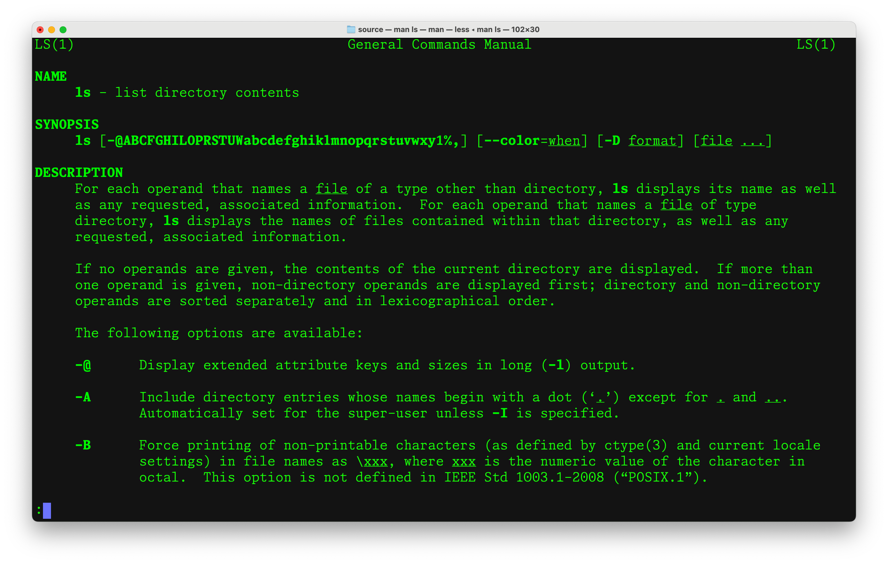

Many mini languages 
===================

In the practice of computing, language is a primary "technology" using which we
get computing done. I believe a reason for this is that language is pretty much
the only tool in our arsenal that can let us specify with sufficient precision
*what* it is that we want done, and *how* we want it to be done, though there
is no clear boundary that separates the *what* from the *how* in practice.

So, in the course of your computing journey, you'll encounter several mini
languages and as you write more programs you'll make some yourself to solve
problems of interest to you and the fields you care about. Building mental
fluidity with picking up such languages on demand is therefore a very valuable
productivity skill.

The shell, being a portal to getting your operating system to do things for
you, presents such "mini languages" that when you develop some comfort with,
will reduce the drudgery of many kinds of mechanical operations you might
otherwise do manually on your computer.

Here, I present some commonly encountered "mini languages".

Basic program/command and arguments
-----------------------------------

You run a command on the shell "prompt" by specifying the command by name, followed
by its arguments separated by one or more spaces. Some examples --

.. code:: bash

    # This is a comment

    # The command below lists a lot of details about the PDF files in 
    # the present working directory.
    ls -l *.pdf

    # This command creates a new directory named "mypdfs"
    mkdir mypdfs

    # This command creates a new directory named "My PDFs".
    mkdir 'My PDFs'
    # Note that because we use spaces as argument separators,
    # we need to somehow provide a directory name that contains
    # a space. So we do that by surrounding it with quote characters.

    # This command creates a new directory named - My PDF's sources
    mkdir 'My PDF'"'"'s sources'
    # Note that because the ' character is now special, if we want
    # to use a directory name that itself contains a quote character,
    # we need some way to mark the character inside as "this is not
    # the quote that ends the directory name". Such a way doesn't
    # exist for such single quoted strings, but the shell also
    # provides "double quoted" strings (which work a little differently)
    # and will also combine consecutive such strings for us if
    # given without intervening spaces. So here, we're in principle
    # constructing three strings -- 'My PDF', "'", and 's sources' --
    # and letting the shell join them up.

    # This command creates a new directory named - My "PDF"'s sources
    mkdir 'My "PDF"'"'"'s sources'
    # The " character can be freely used within ' quoted strings since
    # the single quote strings are in general literal.

So you see, we already have some syntax about how to construct strings.
The syntax for strings is perhaps the mini language that has the greatest
variety across various programming languages and environments. So do not
assume that there is only one way to notate strings. Always read the manual
on that and test your assumptions.

Manual pages
------------

It is impossible for anyone to know by heart all the ways in which every
command or program available to you on the shell can be used. Usually due to
frequent use you might have a hand full of these memorized. But at various
times, you'll need to refer to documentation to learn more.

All the shell commands have associated manual pages, often abbreviated as "man
pages" because they're accessed via the ``man`` program.

When you type ``man ls`` in a shell, it will show the manual page for the ``ls``
program (see below). Note the various sections clearly marked out.

    The first page of the manual for the "ls" program as displayed by
    the ``man ls`` command.

There is a visual language to these "man pages". The "NAME" section very briefly
but clearly tells you what the program does. The "SYNOPSIS" section lists various
common options - the "syntax" of the arguments of the program. 

Some arguments start with a hyphen "-" and usually a single character (like
``-D``). These are sometimes referred to as "flags" or "switches" because
(often) their presence as an argument is all that is needed to trigger a
particular behaviour, (often) irrespective of where they occur in the argument
order. Some programs provide two versions of such switches, one short
identified by a single hyphen and one long, identified by a double hyphen (like
``--date-format``). 

The "SYNOPSIS" section might also present some arguments within square 
brackets -- like ``[--date-format=FORMAT]``. If an argument is wrapped in such
square brackets, it means that that argument is optional.

.. admonition:: [OPTIONAL] arguments

   The SYNOPSIS sections of man pages present optional arguments within square
   brackets, like ``[--date-format=FORMAT]``. Conversely, if an argument
   is presented without surrounding ``[]``, it means that that particular
   argument MUST be provided - i.e. is compulsory.

All man pages also have a "SEE ALSO" section at the end that might give
useful pointers to related pages.

.. admonition:: Notice the ":" at the bottom left of the screen

   The man page shows the contents using the ``less`` program which
   permits you to scroll and move through the contents.

Scrolling through content
-------------------------

The ``less`` program presents a way to navigate long form content by scrolling
and searching and jumping. When it displays the ":" character at the bottom left of
the screen, you can type some keys that will cause some movement. Here
are a few useful keys --

* ``h`` for "help", shows a summary of commands available
* space bar will move down by a page
* ``/<regex-pattern>`` will search for a pattern in the text
* ``n`` and ``N`` jump to the "next" and "prev" occurrences of the pattern in search mode
* ``q`` quits the less program.

For info on more navigation keys and other features of ``less``, refer to ``man
less``.

See :doc:`regular expressions <regex>` for information about the family of
"regular expression" languages that are used across various programming
environments.

Connecting programs
-------------------

Programs launched from the shell read from their "standard input" a.k.a.
"stdin" and write their output to their "standard output" ("stdout") and
"standard error" ("stderr"). This structure lets us compose programs together
by connecting ("piping") what is sent on one program's stdout into the stdin of
another program, and display the stdout of that second program on the terminal.

Here is an example that displays how many files and directories are present in
the current directory using the ``ls`` and ``wc`` (word count) programs
connected by a pipe.

.. code:: bash

    ls | wc -l

The idea behind the above program is that ``ls`` outputs one file name per
line and therefore we can determine the number of files by counting the
number of lines output by ``ls``, which is exactly what ``wc -l`` does.
(To learn about ``wc`` and why ``wc -l``, see ``man wc``.)

We can connect more than one program in a chain of pipes like this -

.. code:: bash

    ls | grep -i '[.]pdf$' | wc -l
    # The above program counts the number of "PDF" files in the
    # current directory. Exercise: Modify the program to count
    # the number of PNG files.

An important property of the pipeline is that the if the receiving program
terminates before the sending program finishes it task, then the sending
program is also terminated with a "Broken pipe". While in our own programs this
might turn up as an error when we didn't handle the condition properly, most
shell programs are written so that they don't have to run for longer than
needed. For example, if you're in a directory where there are 50000 files and
you only want to see the details of the first 10 files, you can do ``ls -l |
head`` and the ``ls`` program will do no work to list out files beyond the
first 10, because its ``stdout`` will have been closed by then. On the other
hand, a pipe like ``ls | tee /tmp/out.txt | head`` might end up writing a lot
of lines to ``/tmp/out.txt`` before terminating. This non determinacy is
due to the fact that all the programs in the pipeline are executing in parallel
(at least in principle and on today's computers, in practice as well). They're
all coordinating only via their respective input and output streams.

Common commands
---------------

Learn about the following commands using ``man <command-name>``.

.. code:: bash

    ls pwd mkdir rm cd grep cat find wc sort uniq date

