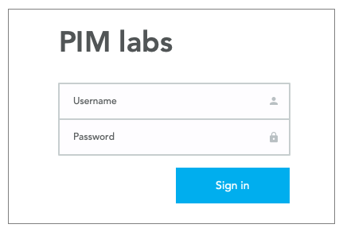
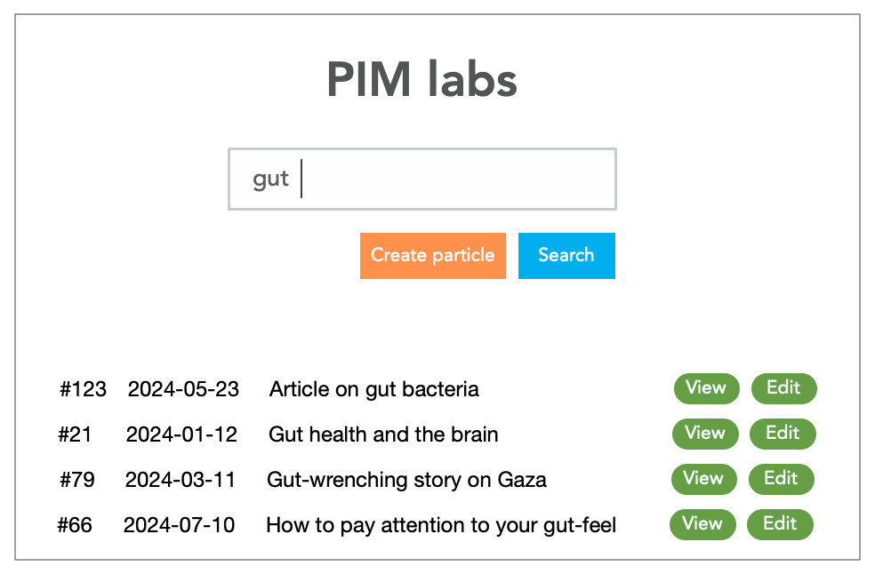
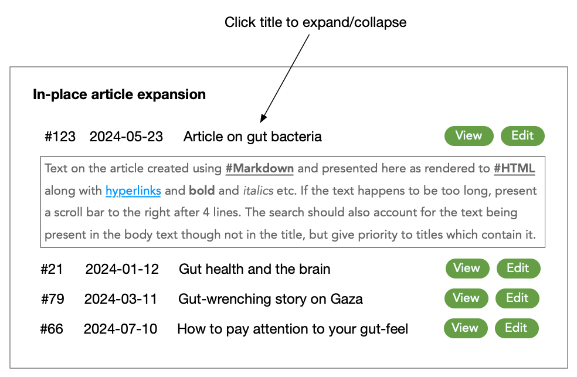
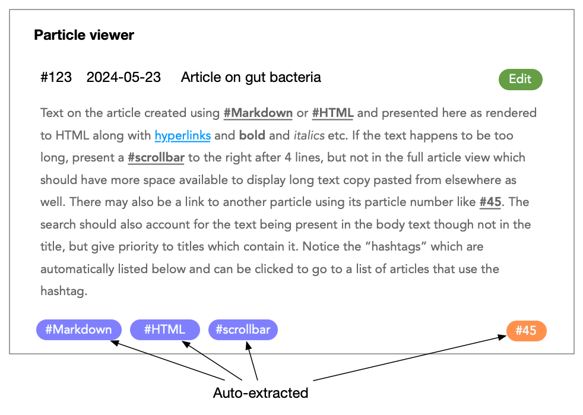
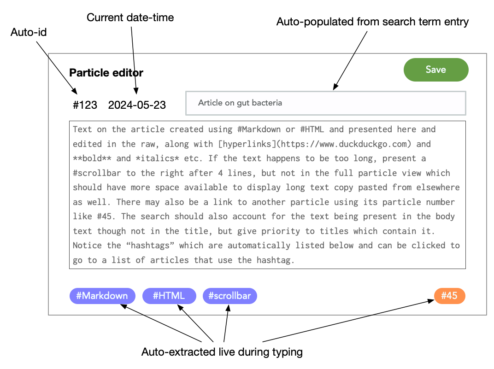

PIM app
=======

This chapter describes a practice app you can build from scratch to exercise
all facets of programming an application.

PIM stands for "personal information manager". A simple personal note keeping app
that offers fast retrieval. We'll save our notes, which we call "particles" with
a title and body text composed using Markdown. 

Design sketch
-------------

The app is "personal", and so has a login page. Even if you're only running it
locally, it might help to have it be password protected.

   PIM login view

The main entry point after login is the search page, which also offers a quick
way to create a new entry by typing the title you want into the search bar and
clicking "Create" if no such article turned up. The search results are provided
in near-realtime.

   PIM search page

Clicking on a title in the search results will expand/collapse the particle 
in-line.

   PIM search results list and in-place viewer

Clicking on the "view" button will take you to the full "particle viewer".

   PIM particle viewer

Clicking on the "edit" button will take you to the "particle editor".

   PIM particle editor

Feature space
-------------

While we've asked for a lot, to make progress on the application, do not try to
build everything at one go. Start by trimming down and prioritizing what we
want (literally "choosing which one comes first") so we can have a working
version as early as possible and iterate from there. This "early working
version" is what we'd call a "minimum viable product". In general, there is
much more to be done for "viability" in the market, but in our case, we can be
quite lenient. For example, we could do a bare-bones, no-live interactions UI
that only consists of forms and click links for starters.

The advantage of such a paring down is that you get to work through all the aspects
of the system -- the front-end & back-end -- and think through important issues like
privacy and security up front without burdening yourself with a lot of details.
The ability to do such a paring down is a valuable skill.

Also, as Einstein said, pare it down to something "simple, but not simpler"
for the MVP.

TODOs
-----

1. [done] Design sketch with some indicative features is given
2. [todo] API design for the service using REST approach
3. [todo] Data modelling
4. [todo] Process flow diagrams
5. [todo] Sequence diagrams
6. [todo] Security and user info management.
7. [todo] User interface implementation
8. [todo] Testing
9. [todo] Iterate by going back to step 2. (Would you need to go back to 1?)

