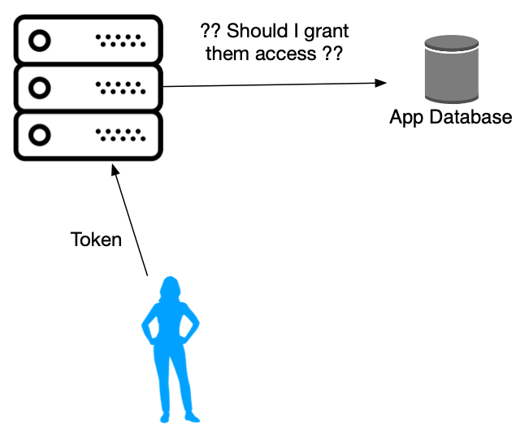

Trust issues
============

You're by now used to typing in a username and password to identify yourself to
a website. Different websites also employ different means to make this happen.
This chapter is about the various aspects and mechanisms used to implement
"authentication" (identifying a user) and "authorization" (granting permissions
to users). We'll look at some basic principles which help think about trust
issues with web applications, and some common techniques.

What's the issue?
-----------------

The internet is, as you know, a wild place. When a server announces its service
to the world -- with its domain name bound to its IP address on some DNS
service -- any other computer connected to the internet can make a request to
the service, at any time, and any number of them can make requests as well.

So a published service needs to guard its resources and data both in order to
serve its intended users, as well as to protect itself and its users from
malicious actors. Designing the security and privacy aspects of a service is
therefore an important activity to be done up front.

A mental model
--------------

To try to understand the security environment under which a service operates,
it is useful to anthropomorphize the actors in the network. Think of your
service as a person with an open shop front who services specific users (like
with, say, a lending library) and browsers and such clients as persons who
visit the shop to avail of the service.

Who is the user?
----------------

a.k.a. Authentication.

   Are they who they claim they are? How does the server authenticate its
   users?

So a user walks into the library and makes a request. You'll first want to
ascertain whether the user is a member already. There are two possibilities at
this point -- either the user is a member already, or the user is not and
wishes to sign up for membership. 

How might a user prove to you that they're a member? You might ask them to
show a "membership card" -- one that you've issued them. Due to the scale
at which services might need to handle requests, they should always assume
that only **authenticated** users can make requests, and only those requests
that they're **authorized** to make. For example, after a user shows you their
library membership card, they can borrow books, but cannot buy them from the
library.

The notion of a "membership card" is usually called a "bearer token" --
something that a user produces to prove to you that they are who they say they
are. The conventional "username + password" combination is one such "bearer
token". The important thing for the service (you the library owner) is that
you have some means by which you can establish the authenticity of the bearer
token. By looking at the card, there is something in it that you can use to
be **sure enough** for yourself that the user has not produced a counterfeit.
In other words, you need a way to identify that the card (token) has been
issued by you and by nobody else.

What can the user do?
---------------------

... a.k.a. Authorization.

   Should the server grant them access to the data?

The card presented by a member may contain additional information like the
membership privileges they have at the library. For example, "level 1" member
may be allowed to borrow 2 books and a "level 2" member may be allowed to
borrow 4 books at a time, and a "privileged member" may be allowed to borrow 10
books at a time and can avail of free home delivery and pickup. You can either
use the information in the card, or if you don't trust your card that much, you
can pull this information from your rolodeck (database) of users.

The card typically also carries an **expiration date** for the membership. This
could either be tied to the period for which the user has paid their
subscription fees to you, or simply to help limit potential for making
counterfeit membership cards -- the longer a card is out there, the more likely
it becomes duplicable at some point.

So a user's membership lasts only until a set date, after which they have to
re-engage and create another membership with the library to avail of its
services. ("Your password has expired. Set your new password now!")

Security UX
-----------

Security measures always place an experience burden on users. So whatever
measures you choose needs to be carefully traded off against inconvenience of
users. For example, if your application keeps notes on behalf of users, there
will be some expectation of privacy and they may not mind, say, if they get
auto-logged-out after an hour of inactivity. If your application is like
Wikipedia and the user is an editor, there is not much of a need to log out the
user at such a short interval since Wikipedia publicly records who edited what,
when and what exact change they made. Wikipedia editors might spend long hours
on the site and would be annoyed if they were asked to login frequently.

Beyond the "re-authentication interval", the balance of UX and security needs
to be considered on a per-application basis and there is no "one solution fits
all" approach. That said, users have become accustomed to some commonly used
mechanisms that they're comfortable using and it is good to leverage these the
most before inventing schemes of  your own (which is almost always a bad idea,
unless you're a security expert).

Remember that the server is always suspicious of the user/client. So it is
natural for the server programmer to think -- "what if the user repeatedly
pummels my server with a sequence of requests testing every combination of user
and password until one succeeds?". To mitigate such a scenario, a common UX
pattern used is to exponentially increase the time interval the user has to
wait between unsuccessful attempts. Usually, sites simplify this by permitting,
say, 3 attempts followed by which the user will have to wait for, say, 15
minutes before trying again. On the iPad/iPhone, keying in the wrong pin a few
times will lock you out for a minute. If you fail again, you'll be locked out
for 5 minutes and if you fail once more you'll be locked out for 10 minutes and
so on. This kind of a strategy broadly goes under the term **exponential
backoff** and is an approach usable in a number of scenarios beyond just
security.

Techniques
----------

"Cryptographic hash functions" -- a.k.a. "message digests" -- are a workhorse
tool for organizing security protocols between applications and users, whether
these users are people operating browsers, or applications making HTTP calls.
While the mathematics of these functions is beyond the scope of this chapter and
course, they are not too hard to understand and use, and they are essential to
constructing secure applications.

A **hash function** or **message digest** is a function that takes a sequence
of bytes and constructs a fixed length sequence of bytes (say 32 bytes) --
called the "hash" or "digest" -- with the specific property that it is
computationally easy to go one way (from message to hash) but inordinately
expensive to determine the message when given the hash, to the point of being
nearly impossible to do so. A key constraint is that the output hash is
completely determined by the input message and the function must always produce
the same hash for the same message (so, you can't have a random number
generator as a "hash function", for instance).

Commonly used hash functions today include SHA1_, SHA256_ and SHA512_. Note
that SHA256 is the same as SHA512 whose output is truncated. SHA1 hashes are
used in git and you'd have already seen strings of hexadecimal numbers like
``27b1260f03b20f463596f2a927cc16c3cb17c0bb`` when you look at your ``git
log``. SHA1 hashes are 20 bytes (i.e. 160 bits) long, SHA256 hashes are 32 bytes
long and SHA512 hashes are 64 bytes long. The longer the hash the harder it is
to "crack" it. SHA1 is secure enough for many applications (such as git), but
at least SHA256 is recommended going forward.

.. admonition:: **Warning**

   The MD5 hash algorithm is considered deprecated for most uses
   and is not considered to be cryptographically safe any more.

.. _SHA1: https://en.wikipedia.org/wiki/SHA-1
.. _SHA256: https://en.wikipedia.org/wiki/SHA-2
.. _SHA512: https://en.wikipedia.org/wiki/SHA-2

Let's see how such a function can be used to authenticate a user.

So a user comes to your application and provides a username and password. You
take that and go check whether that combination is valid and has been recorded
in your database. If yes, admit the user and no, send them away. Right? ....
Wrong!

It is never a good idea to store your user's passwords in the raw in your database.
This is because you want to protect your users passwords in case your application
gets hacked. So how can you store a user's password in an attack-resistant
manner? You hash it.

But a simple ``sha512(username + password)`` is not going to cut it since a
malicious entity can try every combination of letters (assuming the user is not
going to choose a super long password) and generate every possible SHA512
output and figure out from your database what they password of a particular
user is. (This is called a "dictionary attack".)

One possible way around this is to use a random string of bytes ``R`` and
store ``R + hash(R + username + password)`` in the password table
corresponding to the username. Now to check whether the password is correct,
you can retrieve the stored ``R``, compute ``R + hash(R + username +
password)`` using the given password and check whether it matches what you've
stored in your DB. An attacker will have to do a whole lot more work now as
they have to pretty much start from scratch to crack each password. The 
random part ``R`` is also referred to as "salt".

Even this is not considered enough in general and repeated application (called
"rounds") of such a hash or encryption function is used to increase the cost
for an attacker. Fortunately, these functions are readily available to a
programmer -- bcrypt_ and scrypt_.

.. _bcrypt: https://en.wikipedia.org/wiki/Bcrypt
.. _scrypt: https://en.wikipedia.org/wiki/Scrypt

Tokens
------

Username/password combination may be ok for users, but when applications
need to authenticate themselves to other services, do they do the same?
Often no.

Applications are usually issued what are called "bearer tokens" (their
"membership card") which is constructed by the server in a manner in which the
server can establish for itself whether a token is authentic -- i.e. something
the server has created.

One method for this is the HMAC_ function, which is computed on a message ``m``
and a secret key ``K`` roughly like this -- ``HMAC(K,m) = hash(hash(K) +
hash(k + m))`` (with some nuances like padding elided for simplicity), where
``+`` indicates string/bytearray concatenation and the ``hash`` is some strong
hash function like (at least) SHA256_.

.. _HMAC: https://en.wikipedia.org/wiki/HMAC

The key ``K`` is kept as a secret by the server and not revealed to the user.
When the server issues a token with details like "your name is XYZ and you have
level N membership that expires on YYYY-MM-DD", the HMAC function can be used
create a signature for this message that is easy for the server to check. So
the token then becomes something like --
``<card-contents>+HMAC(K,<card_contents>)``. Given such a token, the
card contents are easy to separate out, the server knows its ``K`` and it can
compute the HMAC part and confirm whether it is the same as what is in the
token.

This technique is useful for any piece of information that a server hands out
to its clients that at a later point it needs to check that it was indeed
generated by the server.

Login
-----

The login process for a web application therefore is a sequence like the
following --

1. The client presents "username" and "password".
2. The server checks it against its database (using bcrypt_, for example).
3. The server issues a "bearer token" which can be an opaque and random
   looking sequence of bytes (which it uses as a key to store parseable
   information in its database internally) or a readable sequence of
   bytes.
4. The client receives and saves this bearer token (set to expire after some
   noted time interval) somewhere safe. 
5. The client presents the bearer token to the server whenever it wants to
   avail of some service.

The conventional way in which a server hands out such bearer tokens to
browser-based clients is as a ``Cookie:`` header. Browsers know what to do
with these "cookie" strings. In particular, the next time the user visits the
site, the browser will automatically send any such saved cookies earlier
presented by the server -- i.e. they are associated with the "domain of
origin". The cookies set by site A will only be sent back to site A and not to
another site B.

For services accessing other services via API calls, it is customary to pass
such a bearer token in the ``Authorization: Bearer <token>`` header.

.. admonition:: **Terminology**

    We've used "browser-side" or "client" or "user" to mean refer to a device
    or program that is used by a human user to access a particular online
    service. The term generally used for this concept is **User Agent** --
    i.e. an agent which acts on behalf of a user.

.. figure:: images/signinseq.png
    :align: center
    :alt: Sequence of events for authenticated access to a service

    Shows a "User Agent" signing in with credentials and the service
    allocating a ``sessionid`` to represent the act of providing the
    credentials so that access to the service can be granted for a set
    period of time.

Cross site requests
-------------------

Say website A provides services to its users and checks their credentials
using cookies sent by the browser when their users visit the site.

Say there is another website that presents a page containing elements that
refer to website A and requests need to go to website A to fetch those
elements. Now, the browser would send those cookies to website A, even though
the content is appearing on behalf of website B. This way, it is possible for
website B to hijack the experience of website A and even act in some malicious
ways. Such a request across websites is called a "cross-site request" and
websites will mostly want to protect themselves against such "forgery" (CSRF_).

The way they protect themselves is to issue one-time-use random strings with
every page containing hidden information called a "CSR token" which if not
returned to the user along with form data the website will reject the request.
A server can also indicate in its response headers whether cross-site requests
are permitted (for some services, they may be legitimate requests).

The warning here is that the server shouldn't trust the browser too much.

.. _CSRF: https://en.wikipedia.org/wiki/Cross-site_request_forgery

Cross-site scripting
--------------------

On the flip side, a user shouldn't trust a website too much, in case the site
exploits the trust and sends malicious requests (or replays of earlier
requests) to other services used by the user without their knowledge.

Since these requests typically are sent using Javascript code behind the
scenes, they are referred to as `cross-site scripting`_ vulnerability.

.. _cross-site scripting: https://en.wikipedia.org/wiki/Cross-site_scripting

With this type, the server may be lax about sanitizing content provided by the
user before incorporating the content in any response web pages. We already saw
one instance of this behaviour when we discussed "SQL injection attacks". Here
potentially malicious content can get permanently injected into a user's
experience of a website via a carefully constructed link URL or web page with
such links or code, causing the user to, perhaps, inadvertently send private
information to parties they did not intend to share it with.

Python libraries
----------------

secrets_: Used to generate cryptographically secure random numbers for use in
tokens, etc. Example ``secrets.token_urlsafe(<nbytes>)``.

hashlib_: Secure hashes for various algorithms. Example:
``hashlib.sha256(<byte-string>).hexdigest()``.

`hmac <hmacpy_>`_: Keyed - message authentication hash discussed above. Example:
``hmac.digest(b"key-byte-string", b"byte-message", "sha512").hex()``.

`bcrypt <bcryptgh_>`_: For password hashing. Example: ``hashed =
bcrypt.hashpw(password, bcrypt.gensalt())`` and for checking,
``bcrypt.checkpw(password, hashed)``.

.. _bcryptgh: https://github.com/pyca/bcrypt/
.. _secrets: https://docs.python.org/3/library/secrets.html
.. _hashlib: https://docs.python.org/3/library/hashlib.html
.. _hmacpy: https://docs.python.org/3/library/hmac.html

The Cookie mechanism
--------------------

There are many approaches to storing small quantities of client data associated
with a particular online service within the browser's sandboxed storage areas.
Three mechanisms for small data are used for a variety of purposes --

1. The "cookie" mechanism is used for very small amounts of data (typically
   like a "session id" or "token"), and some flags. This data is typically less
   than about a line of text. The cookie store can be written to by the server
   without any client-side javascript, and the browser will automatically send
   any cookie data associated with a service (called an "origin") identified by
   the tuple ``(protocol, domain, port)``. Cookies can be assigned (optional)
   expiry dates and persist until they expire, or if no expiry date is set,
   they can persist foreve until the user explicitly deletes them.

2. "Session storage" is a key-value store, also for small amounts of data,
   where the data is kept alive for the duration of a browser session
   (associated with a "tab" or "window", even between page refreshes) and
   deleted when the tab or window is closed. (See `MDN session storage`_)

3. "Local storage" is a key-value store similar to session storage, except that
   it lives forever until the user explicitly deletes it. (See `MDN local storage`_)

.. _MDN session storage: https://developer.mozilla.org/en-US/docs/Web/API/Window/sessionStorage
.. _MDN local storage: https://developer.mozilla.org/en-US/docs/Web/API/Window/localStorage

The local and session stores can only be accessed using browser-side
Javascript. All three forms of storage are intended only for storing "small"
amounts of data. In particular, since cookies are sent to the service
automatically by the browser, storing large data in a cookie will increase the
network load on each request. However, local and session storage are not sent
to the server but are managed by browser-side Javascript code.

Here, we'll look only at the cookie mechanism.

Storing cookies
~~~~~~~~~~~~~~~

Whenever your client (browser or other programs) makes a request to your
service via the HTTP protocol, your service will respond with a HTTP status
message, headers and a body.

If your service includes the header named ``Set-Cookie`` (case insensitive),
the browser sees the header and stores the given data into its private storage
area and remembers to send this data back to your service on the next request.
You can refer to the full syntax here -- `MDN Set-Cookie header`_ -- but
the following possible ``Set-Cookie`` values are useful to know about --

.. code::

    Set-Cookie: <cookie-name>=<cookie-value>
    # The above associates the cookie name with the value permanently until the
    # user clears the cookies in their browser.
    # Ex:
    # Set-Cookie: sessionid=iq8h7f3bn47h3

    Set-Cookie: <cookie-name>=<cookie-value>; Max-Age=<seconds>
    # Sets a cookie and marks it for expiry after ``<seconds>`` seconds.
    # Ex: Causes session to expire after 90 minutes
    # Set-Cookie: sessionid=2nt89h1ot481; Max-Age=5400

    Set-Cookie: <cookie-name>=<cookie-value>; Expires=<date>
    # Similar to `Max-Age`, but gives an explicit date-time after which
    # the cookie should expire. The Date is in the "HTTP-Date" format
    # https://developer.mozilla.org/en-US/docs/Web/HTTP/Headers/Date

    # Adding "; Secure" to the above will ensure that the cookie is
    # only sent to the service if it is being accessed via the HTTPS
    # protocol.

.. _MDN Set-Cookie header: https://developer.mozilla.org/en-US/docs/Web/HTTP/Headers/Set-Cookie

In your FastAPI handler, if you want to set a cookie on the client,
you can set it on the ``Response`` object like this --

.. code:: python

    from fastapi import FastAPI
    from fastapi.responses import JSONResponse, HTMLResponse

    app = FastAPI()

    @app.post("/somewhere/{subpath}")
    async def handler(subpath : str):
        # ... your code....
        response = JSONResponse(key=value)
        response.set_cookie(sessionid="1j9h348noh4g")
        return response

Reading cookies
~~~~~~~~~~~~~~~

The client-side and the server-side dont need to do anything to read
the cookies from the client and get it on the server side. The browser
will do it automatically, as long as the cookie was set by the origin 
to which the request is being made.

On the server side, a cookie is received using the ``Cookie:`` header.
(See `MDN Cookie header`_)

.. _MDN Cookie header: https://developer.mozilla.org/en-US/docs/Web/HTTP/Headers/Cookie

.. code::

    # Ex:
    Cookie: sessionid=o87ht9823gt; userid=meow@catsrus.com

Server libraries typically provide simple functions or classes to read
and parse these key-value pairs from such ``Cookie:`` headers.

Note that both ``Set-Cookie:`` and ``Cookie:`` headers can occur multiple
times in a response or request respectively.

Your FastAPI handler for a request can access a cookie whose key is, say, ``sessionid``
by declaring a ``Cookie`` parameter as follows --

.. code:: python

    from typing import Annotated
    from fastapi import Cookie, FastAPI

    app = FastAPI()

    @app.get("/somepath/{subpath}")
    async def handler(subpath : str, sessionid: Annotated[str | None, Cookie()]):
        #....your code...

The above declaration will instruct FastAPI to read ``Cookie`` headers in the
response and extract the value of the cookie named ``sessionid`` and pass it as the
second argument (in this case). Note that since we haven't given a default value
for the ``sessionid`` parameter, the cookie **must** be present or the server will
generate an error. To specify an optional cookie, provide a default value for the
cookie parameter.

In browser-side Javascript code, cookies set by the server can be accessed
using `document.cookie`_. It's not usually needed, so we won't go into it further.

.. _document.cookie: https://developer.mozilla.org/en-US/docs/Web/API/Document/cookie

Using cookies for session management
~~~~~~~~~~~~~~~~~~~~~~~~~~~~~~~~~~~~

The word "session" has multiple meanings in a few contexts pertaining to web
based applications, but two meanings are key -

1. We saw in the earlier section the notion of "session storage" where a
   "session" refers to an open browser window or tab. Once you close the
   window/tab, the session ceases. So in MDN documentation pertaining to 
   the browser-side, a "session" is taken with this meaning.

2. In the context of a service requiring login, the period for which the user
   is considered to be authenticated is the other notion of "session" that's
   used. In this case, it is not relevant whether the user has the window/tab
   open. Such a session can persist even across rebooting of the user's
   computer. While even such sessions have an expiry date set on them, they are
   more convenient for users in that they're asked to key in their credentials
   (username and password) relatively less frequently.

Applications typically use the cookie mechanism to manage sessions of the
second kind. Below is a handler for signin and for another service end point
that requires the user to be authenticated, as a code illustration.

.. code:: python

    from typing import Annotated
    from fastapi import Cookie
    from fastapi.responses import JSONResponse
    from pydantic import BaseModel
    import hmac, secrets

    class Credentials(BaseModel):
        username: str
        password: str

    server_secret_key = secrets.token_bytes(nbytes=32)
    # This key is usually managed by an internal service and
    # secure store, but is ok to generate fresh on start of
    # server. Ideally it will also have to be "rotated" 
    # (i.e. changed) at some interval.

    def sign(text: str):
        return hmac.digest(server_secret_key, text.encode(), 'sha256').hex()

    @app.post("/signin")
    def signin(creds: Credentials):
        validate_credentials(creds.username, creds.password)
        # The above makes any necessary calls to the database.

        sessionid = secrets.token_urlsafe(nbytes=16)
        signature = sign(sessionid)
        response = JSONResponse(content={"status":"success"})
        response.set_cookie(key="session", value=f"{sessionid}_{signature}", max_age=86400)
        return response

    @app.get("/someresource/{resid}")
    def get_someresource(resid : str, session : Annotated[str, Cookie()]):
        sessionid, signature = session.split("_")
        # Checking whether the given signature is the same as what
        # we'd produce if we signed the sessionid ensures that the
        # session was indeed created by us (with an overwhelmingly
        # high probability).
        if signature != sign(sessionid)
            # This is an invalid session since we know we didn't
            # generate it. Note that to reject invalid sessions, 
            # we didn't actually need to touch the database.
            raise HTTPException(401, details="Unauthorized")

        # Authenticated. Now we have to make sure that the
        # user has permission to access this resource.
        # This is often done using a faster and temporary
        # "session store" using an in-memory DB like Redis.
        # That way, the main database is not held up for
        # small tasks like this, besides Redis being much faster
        # than regular DBs for such use cases.
        userid = db_get_session_user(sessionid)

        check_authorization(userid, f"/someresource/{resid}")
        # We expect check_authorization to raise a 401 HTTPException
        # in case that failed.

        # All is well. Respond to the request.
        return response

Advanced topics
---------------

* Access Control Lists
* Capability Based Security

